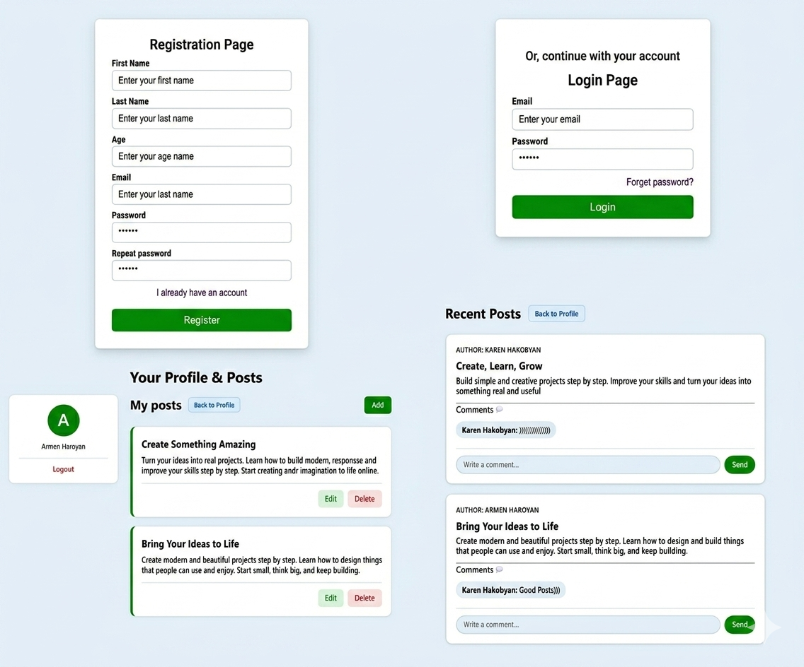

### 📝 Project Interface Showcase

The screenshot below displays the main post feed of the application.

#### Key Interface Features Shown:
*   **Navigation Header:** Includes the main title "Recent Posts" and a "Back to Profile" button, indicating a logged-in user state.
*   **Dynamic Post Cards:** Each post is contained within a clean, shadowed white card.
    *   **Post Details:** Displays the author's full name, the post title (bold), and the full content of the post.
    *   **Comment Section:** Includes a "Comments" heading with an icon and lists existing comments with the commenter's name.
    *   **Interactive Input:** A text input field labeled "Write a comment..." with a green "Send" button for each post.

#### Technology Stack in This View:
*   **HTML:** Structuring the post feed, cards, input fields, and buttons.
*   **CSS:** Styling the clean, modern look, including card shadows, rounded corners, button colors, and typography layout.
*   **PHP:** (Implied) Dynamically fetching the post and comment data from the MySQL database and rendering it into the HTML structure.
